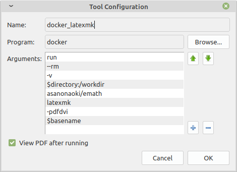
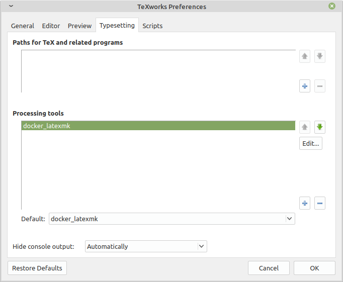

[日本語版 README はこちら](/README_ja.md)

# asanonaoki/emath
The minimal [emath](http://emath.s40.xrea.com/) docker image


## Summary
You can use emath easily through docker.


## Install
```
docker pull asanonaoki/emath
```

## Usage
### Primitive Usage
```
docker run --rm -it -v $PWD:/workdir asanonaoki/emath platex -shell-escape YOUR_FILE_NAME.tex
docker run --rm -it -v $PWD:/workdir asanonaoki/emath dvipdfmx YOUR_FILE_NAME.dvi
```
Replace YOUR_FILE_NAME with the actual tex file name.

### Advanced Usage(latexmk)
First, create .latexmkrc file. Example is below:
>$latex = 'platex -shell-escape %O %S';  
>$dvipdf = 'dvipdfmx %O -o %D %S';  

Now, you can use latexmk command.
```
docker run --rm -it -v $PWD:/workdir asanonaoki/emath latexmk -pdfdvi YOUR_FILE_NAME.tex
```
Replace YOUR_FILE_NAME with the actual tex file name.

If you would like to use sty and/or fonts files, add these settings in the .latexmkrc file like this:
>ensure_path('TEXINPUTS', './sty//');  
>ensure_path('OSFONTDIR', './fonts');  

By doing so, sty files in your sty subdirectory and fonts files in your fonts subdirectory are included.

Directory structure
<pre>
.
├── .latexmkrc
├── YOUR_FILE_NAME.tex
├── fonts
│   └── bar.ttc
└── sty
    └── foo.sty
</pre>

### Via TeXworks
Before going to further steps, read Advanced Usage(latexmk) above and make sure a pdf file is generated successfully through the command(from the teminal).

To use this image via TeXworks, adjusting typesetting is mandatory.

1. After starting TeXworks, click "Edit" and "Preferences..."
1. Choose the "Typesetting" tab.
1. Click "+" icon at the bottom of the Processing tools.
1. Edit appropriately.
    1. Any name will do. I put "docker_latexmk"
    1. Program is "docker"
    1. Arguments are "run", "--rm", "-v", "$directory:/workdir", "asanonaoki/emath", "latexmk", "-pdfdvi", "$basename". Put each of them in the seperate box. Clicking "+" icon enables you to put another argument.
    1. Check "View PDF after running"
    1. Click "OK"

5. Confirm the processing tool(docker_latexmk) appears in the list. I recommend you set the tool(docker_latexmk) default.

I deleted all the "Paths for TeX and related programs" and "Processing tools" other than the created one(docker_latexmk) for brevity. It is not necessary to do this.

## Author
[Asano Naoki](https://asanonaoki.com/blog/)


## License
Under the MIT License. See [LICENSE](/LICENSE) for details.


## Acknowledgments
- Based on [Paperist/texlive-ja: The minimal TeXLive Docker image for Japanese](https://github.com/Paperist/texlive-ja) docker image.
- Thanks for [emath](http://emath.s40.xrea.com/).

