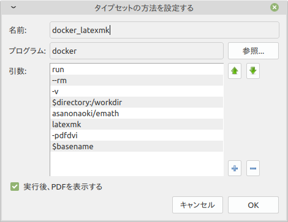
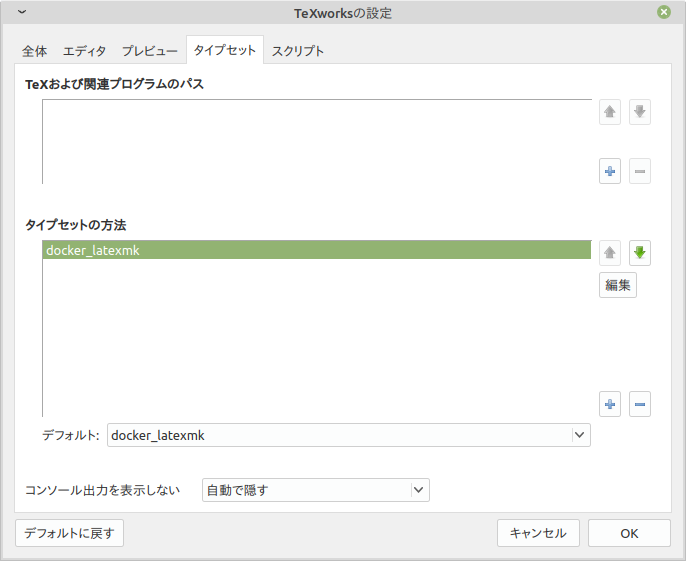

# asanonaoki/emath
[emath](http://emath.s40.xrea.com/)を使うための最小限のdockerイメージ


## 機能
dockerを活用して手軽にemathが使える環境を構築できます。


## インストール
```
docker pull asanonaoki/emath
```

## 使い方
### 原始的な使い方
```
docker run --rm -it -v $PWD:/workdir asanonaoki/emath platex -shell-escape YOUR_FILE_NAME.tex
docker run --rm -it -v $PWD:/workdir asanonaoki/emath dvipdfmx YOUR_FILE_NAME.dvi
```
YOUR_FILE_NAMEの部分はtexファイルのファイル名に置き換えてください。

### 発展的な使い方(latexmk)
最初に.latexmkrcファイルを作ってください。例：
>$latex = 'platex -shell-escape %O %S';  
>$dvipdf = 'dvipdfmx %O -o %D %S';  

これで以下のコマンドが実行できるようになります。
```
docker run --rm -it -v $PWD:/workdir asanonaoki/emath latexmk -pdfdvi YOUR_FILE_NAME.tex
```
YOUR_FILE_NAMEの部分はtexファイルのファイル名に置き換えてください。

styファイルやfontsファイルを使いたい場合は、以下の設定を.latexmkrcファイルに書き加えてください。
>ensure_path('TEXINPUTS', './sty//');  
>ensure_path('OSFONTDIR', './fonts');  

これにより、styサブディレクトリの中にあるstyファイルと、fontsサブディレクトリにあるfontsファイルが含まれるようになります。

ディレクトリ構成
<pre>
.
├── .latexmkrc
├── YOUR_FILE_NAME.tex
├── fonts
│   └── bar.ttc
└── sty
    └── foo.sty
</pre>

### TeXworks経由の使い方
次の段階に進む前に、上の発展的な使い方(latexmk)を読んで、コマンド（端末）からPDFファイルが作成できることを確かめてください。

このイメージをTeXworks経由で使うためには、タイプセットを調整することが不可欠です。

1. TeXworksを起動したら、「編集」、「設定」の順にクリックします。
1. 「タイプセット」タブを選びます。
1. 「タイプセットの方法」の下にある「＋」アイコンをクリックします。
1. 適切な設定を行います。
    1. 名前は何でもいいです。ここでは「docker_latexmk」としています。
    1. プログラムは「docker」です。
    1. 引数は、「run」、「--rm」、「-v」、「$directory:/workdir」、「asanonaoki/emath」、「latexmk」、「-pdfdvi」、「$basename」です。それぞれ１つずつボックスに入力してください。「＋」アイコンをクリックするとボックスに入力できるようになります。
    1. 「実行後、PDFを実行する」にチェックします。
    1. 「OK」をクリックします。

5. 先ほど作成したタイプセットの方法がリストにあることを確認します。それをデフォルトに設定することをおすすめします。

上記の画像ではわかりやすくするために、先ほど作成したもの以外の「TeXおよび関連プログラムのパス」と「タイプセットの方法」はすべて削除してありますが、そのようにする必要はありません。


## 著者
[浅野直樹](https://asanonaoki.com/blog/)


## ライセンス
MITライセンスの元にライセンスされています。詳細は[LICENSE](/LICENSE)をご覧ください。


## 謝辞
- [Paperist/texlive-ja: The minimal TeXLive Docker image for Japanese](https://github.com/Paperist/texlive-ja)のdockerイメージをもとに拡張しました。
- これまで[emath](http://emath.s40.xrea.com/)にお世話になってきたので、これを簡単に使えるようにしました。

